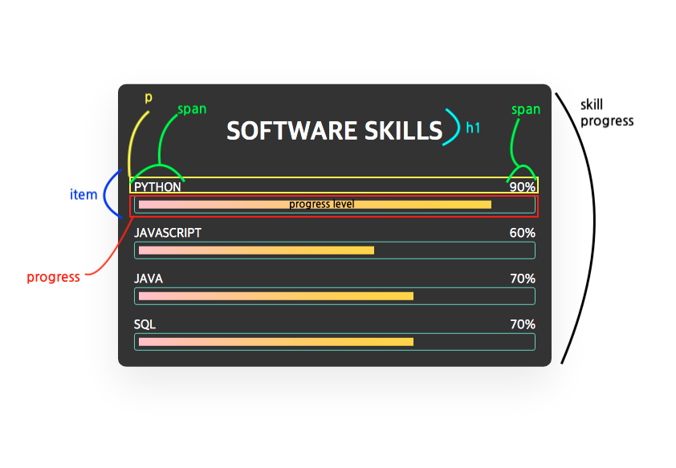
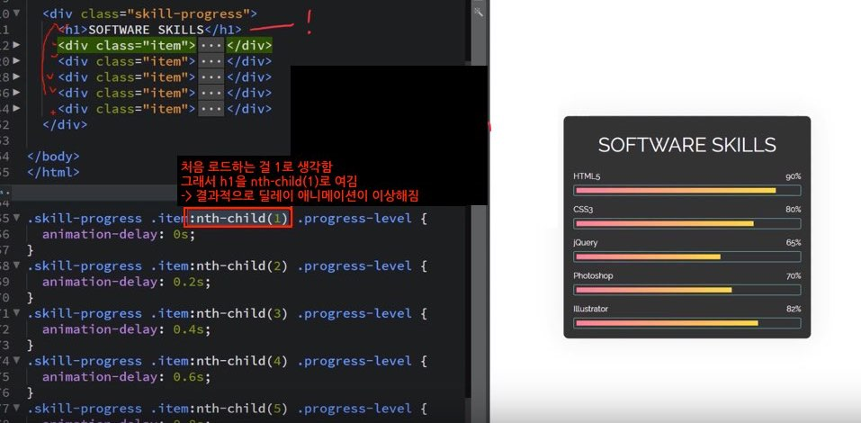

# 그라데이션 바 애니메이션

## 1. preview
### keyframe, animation, nth-child, nth-of-type flex, position 사용
#### 애니메이션 스킬 프로그래스바 + delay적용하기 


## 2. 코드 분석

### 1) html
- 아래 그림과 같은 구조로 클래스가 구성되어 있음



```html
<body>
    <div class="skill-progress">
        <h1>SOFTWARE SKILLS</h1>
        <div class="item">
            <p>
                <span> PYTHON</span>
                <span>90%</span>
            </p>
            <div class="progress">
                <div class="progress-level" style="width:90%"></div>
            </div>
        </div>

        <div class="item">
            <p>
                <span> JAVASCRIPT</span>
                <span>60%</span>
            </p>
            <div class="progress">
                <div class="progress-level" style="width:60%"></div>
            </div>
        </div>

        <div class="item">
            <p>
                <span>JAVA</span>
                <span>70%</span>
            </p>
            <div class="progress">
                <div class="progress-level" style="width:70%"></div>
            </div>
        </div>


        <div class="item">
            <p>
                <span>SQL</span>
                <span>70%</span>
            </p>
            <div class="progress">
                <div class="progress-level" style="width:70%"></div>
            </div>
        </div>
    </div>
</body>
```

<br/><br/>

### 2) css

#### (1) 전체를 감싸는 부모 클래스 skill-progress에 디자인 적용하기 

- `position`, `translate`를 사용해 `skill-progress`를 수직, 수평 중앙 정렬 시킴

```css
.skill-progress{
    width: 500px;
    padding: 20px;
    background-color: #333;
    border-radius: 10px;
    color : #fff;
    box-shadow: 0 20px 50px rgba(0, 0, 0, 0.089);

    /* 해당요소를 수직,수평중앙정렬 */
    position: absolute;
    top : 50%;
    left : 50%;
    transform: translate(-50%, -50%);      /*translate(-top위치, -left위치)*/
}

.skill-progress h1{
    text-align: center;
    margin-bottom: 40px;
}
```

<br/>

#### (2) item에 hover애니메이션 적용하기

- `item`에 마우스 올리면 `scale`로 인해 크기가 커지게 함

```css
.item {
    transition: 0.4s;

}
.item:hover {
    border-radius: 3px;
    box-shadow: 7px 7px 10px rgba(0, 0, 0, 0.753);
    transform: scale(1.05);            /*1.05배 커지게함*/
}
```

<br/>
<br/>

#### (3) item의 p태그 디자인 적용하기

- `item`의 `p`태그 안에는 2개의 `span`태그가 있음
- `p`의 자식은 `span`이 `float`값을 가지면, 부모인 `p`태그는 높이값을 잃어버림
- 그래서 `p`태그에 `overflow:hidden`을 하면 원래 높이값을 찾아감
    */
```css
.item p{
    overflow: hidden;       /*p태그 높이 회복*/
    margin-bottom : 0;      /* p태그 자체가 차지하는 마진을 없애기 */

}

/* p태그안에 있는 span을 왼쪽, 오른쪽 정렬을 시켜야함 */
.item p span:nth-child(1){  /*span:first-child*/
    float : left;
}
.item p span:nth-child(2){  /*span:end-child*/
    float: right;
}
```

<br/>
<br/>

#### (4) progress-level에 차오르는 애니메이션 적용하기

- `.progress-level`에 `animation-fill-mode: both`을 적용함
- 그러면 애니메이션의 반복이 끝나면 무조건 `keyframe`에서 `100%`구간에 머무르게 함

```css
/* 그라데이션 막대를 감싸는 박스 */
.progress{
    border : 1px solid #6cd4c4;
    padding : 5px;
    border-radius: 3px;
}

/* 그라데이션 막대 */
.progress-level{
    height: 10px;
    background : linear-gradient(to right, pink, gold);   /*방향(deg각도도 가능), 시작색상, 종료색상*/
    animation: ani;
    animation-duration: 1s;                               /*1초만에 발생한 애니메이션이 끝나게 함*/

    animation-fill-mode: both; 
    /*애니메이션이 반복이 끝나면 -> 무조건 keyframe에서 100%구간에 머무르게 해라
    애니메이션은 기본적으로, 0%->100%->0%로 진행됨. 
    근데, animation-fill-mode 설정이 없으면 100%구간에서 멈추지 않고 애니메이션이 부자연스러움
    100%구간에서 멈추게 해서 -> 로딩 후, 바로 꽉찬 막대를 만들기 위해 fill-mode를 사용
    */
}

/* 처음 로드될 때, 그라데이션바들이 서서히 차오르는 애니메이션 주기 */
@keyframes ani{
    0%{
        width: 0;   /*시작할 때만 width가 0이게만 하면 됨*/
    }
}
```

<br/>
<br/>

#### (5)  progress-level에 딜레이 적용하기

- `progress-level`에 접근할 때 `skill-progress`안에 있는 `item`요소 안의 영역으로 접근함
- 그래서 `.skill-progress`의 자식인 첫번째 `item`의 -> `item`안에 있는 `progress-level`에 애니메이션을 줌
- `item:nth-child(1)`은 같은 레벨에서 처음 로드되는 걸 `1`로 보기 때문에, 같은 레벨에 있는 `h1`을 `1`로 봄
- 그러한 경우 순서대로 그라데이션바가 움직이지 않음
- 그래서 `nth-of-type`를 하면, 처음 로드되고 & `class`가 `item`을 `1`로 보게 할 수 있음



```css

.skill-progress .item:nth-of-type(1) .progress-level{
    animation-delay: 0s;
}
.skill-progress .item:nth-of-type(2) .progress-level{
    animation-delay: 0.2s;
}
.skill-progress .item:nth-of-type(3) .progress-level{
    animation-delay: 0.4s;
}
.skill-progress .item:nth-of-type(4) .progress-level{
    animation-delay: 0.6s;
}

```


